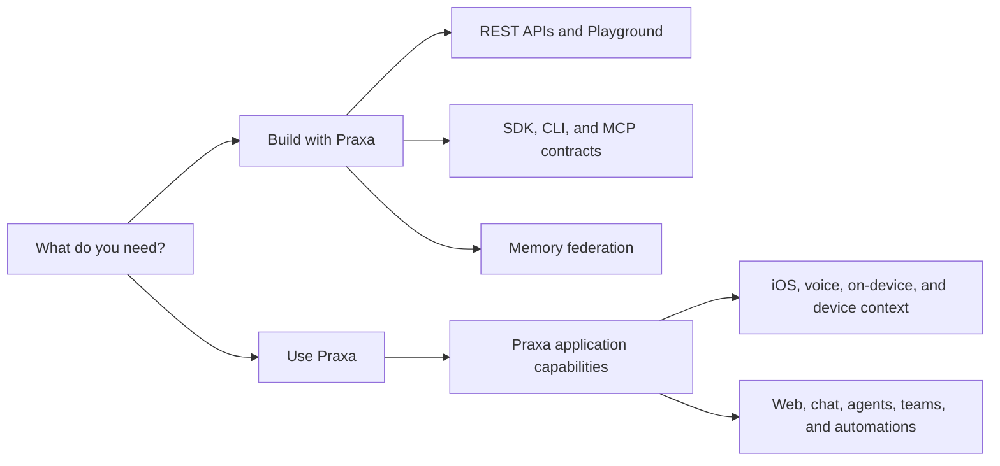

{/* Generated from data/public-capabilities.json. Run npm run docs:generate after changing the catalog. */}

Use this atlas to answer two separate questions: **what can Praxa do on its product surfaces**, and **what can your application call through a documented developer contract**.

<Warning>
A product capability is not automatically a public API. Follow the linked developer service when one exists. Keep Execution Fabric API keys, Integration Gateway OAuth tokens, and provider credentials in their documented boundaries.
</Warning>

## Developer services

| Service | Availability | Surface | Authentication | Start |
|---|---|---|---|---|
| **Execution Fabric** Submit, inspect, stream, and cancel durable tasks through the v1 API. | Partner preview | REST API and API Playground | Personal workspace API key | [Overview](/fabric) · [Tutorial](/tutorials/durable-tasks) · [Reference](/fabric/api/execute) · [Playground](/api-playground/overview) |
| **Integration Gateway missions** Create governed missions with budgets, signals, resumable events, and cancellation. | Deployment-specific | REST API through the SDK, CLI, or MCP host | Short-lived delegated OAuth token | [Overview](/concepts/missions) · [Tutorial](/tutorials/mission-lifecycle) · [Reference](/api-reference/overview) |
| **TypeScript SDK** Use typed mission, event, capability, trace, skill, and memory contracts from Node.js. | Live | @praxa/sdk 0.3.0 | Short-lived delegated OAuth token for Gateway calls | [Overview](/sdk/overview) · [Tutorial](/quickstart) · [Reference](/sdk/praxaclient) |
| **Praxa CLI** Inspect versions, diagnose a Gateway, operate missions, and plan memory sources from a terminal or CI job. | Live | @praxa/cli 0.3.0 | OAuth token for Gateway commands; none for version and local planning | [Overview](/cli/overview) · [Tutorial](/cli/recipes) · [Reference](/cli/commands) |
| **MCP contracts** Register 12 stable Aura-compatible wire tools in an MCP-compatible host. | Live | @praxa/mcp-contracts 0.3.0 | None for contract inspection; delegated OAuth for runtime calls | [Overview](/mcp/overview) · [Tutorial](/tutorials/mcp-tools) · [Reference](/mcp/tools) |
| **Memory federation** Query Mem0, LangGraph, Zep, Graphiti, Letta, OpenAI Agents, and custom sources without migrating first. | Live | @praxa/sdk/memory 0.3.0 | Caller-owned provider clients in your backend | [Overview](/memory-federation/overview) · [Tutorial](/tutorials/memory-federation) · [Reference](/memory-federation/sdk) |
| **Hosted memory candidates** Stage portable, subject-scoped candidates for lexical query, export, and content-erasing deletion. | Qualification preview | REST API and API Playground | Personal workspace API key with memory:read or memory:write | [Overview](/memory-federation/api) · [Tutorial](/tutorials/hosted-memory-candidates) · [Reference](/memory-federation/api) · [Playground](/api-playground/overview) |
| **Signed webhooks** Receive run lifecycle notifications, verify the raw body, and deduplicate retries. | Partner preview | Execution Fabric webhook delivery | Scoped personal workspace authority plus endpoint signing secret | [Overview](/fabric/api/webhooks) · [Tutorial](/tutorials/webhooks) · [Reference](/fabric/api/webhooks) |
| **Events, usage, and observability** Reconnect to event streams, inspect terminal state, and reconcile usage without treating admission as completion. | Partner preview | SSE, run readback, usage API, and webhook receipts | Personal workspace API key or deployment-issued OAuth token, depending on surface | [Overview](/use-cases/monitoring-and-observability) · [Tutorial](/tutorials/observability) · [Reference](/fabric/api/events) |
| **API Playground** Build and inspect Execution Fabric and hosted-memory requests directly from the documentation. | Live | Interactive documentation | A disposable credential that you supply for the selected public contract | [Overview](/api-playground/overview) · [Tutorial](/api-playground/overview) · [Reference](/api-reference/overview) · [Playground](/api-playground/overview) |

## Praxa product capabilities

These capabilities are grouped by the product job they support. Each guide includes example outcomes and the runtime boundary you should verify.

<CardGroup cols={2}>
  <Card title="Core chat and AI pipeline" icon="book-open" href="/product-guides/chat-and-models">
    9 provided capabilities with examples and supported surfaces.
  </Card>
  <Card title="Agent runtimes and surfaces" icon="book-open" href="/product-guides/runtimes-and-surfaces">
    6 provided capabilities with examples and supported surfaces.
  </Card>
  <Card title="Memory and personalization" icon="book-open" href="/product-guides/memory-and-personalization">
    8 provided capabilities with examples and supported surfaces.
  </Card>
  <Card title="Research, documents, and media" icon="book-open" href="/product-guides/research-documents-and-media">
    7 provided capabilities with examples and supported surfaces.
  </Card>
  <Card title="Browser and computer automation" icon="book-open" href="/product-guides/browser-and-computer">
    3 provided capabilities with examples and supported surfaces.
  </Card>
  <Card title="Commerce and real-world actions" icon="book-open" href="/product-guides/commerce-and-actions">
    5 provided capabilities with examples and supported surfaces.
  </Card>
  <Card title="Communication and inboxes" icon="book-open" href="/product-guides/communication-and-inboxes">
    3 provided capabilities with examples and supported surfaces.
  </Card>
  <Card title="Automations and proactive agent" icon="book-open" href="/product-guides/automations-and-plans">
    6 provided capabilities with examples and supported surfaces.
  </Card>
  <Card title="Custom agents and multi-agent" icon="book-open" href="/product-guides/custom-and-multi-agent">
    5 provided capabilities with examples and supported surfaces.
  </Card>
  <Card title="Teams, organizations, and social" icon="book-open" href="/product-guides/teams-organizations-and-social">
    7 provided capabilities with examples and supported surfaces.
  </Card>
  <Card title="Device and context" icon="book-open" href="/product-guides/device-and-context">
    4 provided capabilities with examples and supported surfaces.
  </Card>
</CardGroup>

### [Core chat and AI pipeline](/product-guides/chat-and-models)

| Capability | Status | Surfaces | What it does |
|---|---|---|---|
| Multi-model chat | Live | iOS, web | Use one conversation surface across supported frontier models with explicit model selection and thinking controls. |
| Automatic model routing and cost lanes | Live | iOS, web | Route each turn to an appropriate model lane based on the task, latency, and capability needs. |
| Extended thinking and Adaptive Context | Live | iOS, web | Use visible extended reasoning and bounded contextual preparation for harder requests. |
| Attachments and vision | Live | iOS, web | Attach images, documents, and files so Praxa can reason over their contents. |
| Generative UI and tool cards | Live | iOS, web | Render tool results as task-specific cards instead of exposing raw provider payloads. |
| Adaptive chat canvas | Live | iOS, web | Present a contextual new-chat home using current personal information when the surface is enabled. |
| Runtime capability honesty | Live | iOS, web, voice, on-device | Tell the agent exactly which capabilities are available in the current runtime and device context. |
| Latency fast lane and prompt caching | Live | iOS, web | Reduce time to a useful answer through warm prompt caches and a bounded fast lane. |
| Semantic tool selection and reranking | Beta | iOS, web | Pilot semantic ranking and health-aware selection over a large tool catalog. |

### [Agent runtimes and surfaces](/product-guides/runtimes-and-surfaces)

| Capability | Status | Surfaces | What it does |
|---|---|---|---|
| Cloud chat app | Live | iOS, web | Use Praxa's primary streaming agent surface with the cloud tool catalog. |
| Apps, Skills, and Workflows catalog | Live | iOS, web | Discover connected apps, reusable skills, and packaged workflows from one catalog. |
| Realtime voice mode | Live | iOS | Hold low-latency spoken conversations with the Praxa agent. |
| On-device offline model | Live | iOS | Run private offline turns with Apple Foundation Models on supported devices. |
| iMessage agent | Live | iMessage | Message Praxa from the iMessage extension and receive agent replies in the conversation. |
| Widgets and Live Activities | Live | iOS | View current Praxa information from home-screen widgets and supported Live Activity surfaces. |

### [Memory and personalization](/product-guides/memory-and-personalization)

| Capability | Status | Surfaces | What it does |
|---|---|---|---|
| Persistent agent memory | Live | iOS, web, voice, on-device | Retain durable facts, preferences, and context with user-facing correction and deletion controls. |
| Goal and task capture | Live | iOS, web | Propose explicit goal or task records from cloud chat and keep the owner in control of acceptance. |
| Adaptive persona and tone | Live | iOS, web, voice | Adapt tone and framing to the person without changing factual or authority boundaries. |
| Adaptive Human Context Engine | Live | iOS | Use consented, bounded context signals to improve situational relevance; this is a Praxa product capability, not a public ingestion API. |
| Adaptive Context transparency and correction | Live | iOS, web | Show learned rhythm information and let the person correct or abstain from it. |
| Proactive suggestions | Live | iOS | Surface consent-gated suggestions that require an explicit tap before any next action. |
| Native onboarding | Live | iOS | Guide a new user through sign-in and initial setup in a compressed native flow. |
| Persona recipes | Live | iOS, web | Apply a prepared persona preset for a recurring role such as meal or trip planning. |

### [Research, documents, and media](/product-guides/research-documents-and-media)

| Capability | Status | Surfaces | What it does |
|---|---|---|---|
| Web search and live answers | Live | iOS, web, voice | Answer current questions using search, news, weather, and other live sources. |
| Deep research | Live | iOS, web | Run a multi-source research workflow with citations and explicit source handling. |
| Web reading and scraping | Live | iOS, web | Read a URL into usable content and extract structured information. |
| Documents and artifacts | Live | iOS, web | Generate downloadable documents, spreadsheets, and other inspectable artifacts. |
| Presentations and slideshows | Live | iOS, web | Generate presentation decks and media slideshows with resolved assets. |
| Image and video generation | Live | iOS, web | Create images and videos from text or image inputs through the supported provider ladder. |
| Interactive apps and games | Live | iOS, web | Generate and publish small interactive web experiences from a conversation. |

### [Browser and computer automation](/product-guides/browser-and-computer)

| Capability | Status | Surfaces | What it does |
|---|---|---|---|
| Persistent browser sessions | Live | iOS, web | Keep a governed cloud browser session alive across multiple browser steps. |
| In-chat browser | Live | iOS | Use a browser dock inside cloud text chat for explicit browsing and login handoffs. |
| Credential vault and agent-owned accounts | Live | iOS | Complete account sign-in flows without exposing the secret itself to the language model. |

### [Commerce and real-world actions](/product-guides/commerce-and-actions)

| Capability | Status | Surfaces | What it does |
|---|---|---|---|
| AgentCard purchases | Beta | iOS, web | Pilot approval-gated purchases through single-use virtual card authority in the supported environment. |
| Shopping and deals | Live | iOS, web | Research products, compare options, and prepare carts or shopping lists. |
| Food ordering and meal planning | Live | iOS, web | Search menus, plan meals, and use approval-gated handoff for supported ordering flows. |
| Travel planning | Live | iOS, web | Research and compare flights, stays, and itineraries while leaving booking to an explicit handoff. |
| Smart home control | Live | iOS, web, voice | Inspect and control connected SmartThings or Home Assistant devices through supported actions. |

### [Communication and inboxes](/product-guides/communication-and-inboxes)

| Capability | Status | Surfaces | What it does |
|---|---|---|---|
| Agent email | Live | iOS, web | Use a Praxa-owned email address for agent send-and-receive workflows where account delivery is available. |
| Inbox One | Live | iOS, web | Triage multiple connected inboxes from one agent-assisted view. |
| Agent Hub | Live | iOS, web | Inspect agent tasks, execution status, sales items, invoices, and related events. |

### [Automations and proactive agent](/product-guides/automations-and-plans)

| Capability | Status | Surfaces | What it does |
|---|---|---|---|
| Scheduled automations | Live | iOS, web | Create recurring agent jobs such as digests and follow-up workflows. |
| Monitors and watches | Live | iOS, web | Watch web pages, prices, or conditions and notify when the condition changes. |
| Missions and plans | Live | iOS, web | Break a longer goal into an explicit plan with visible steps and bounded execution. |
| Plan feasibility | Live | iOS, web | Check whether a plan fits available time using explicit arithmetic and constraints. |
| Daily briefing and proactive greeting | Live | iOS, web | Assemble a day-start view from relevant calendar, task, and follow-up information. |
| Push and smart notifications | Live | iOS, web | Deliver automation results, monitor triggers, and team activity through configured notifications. |

### [Custom agents and multi-agent](/product-guides/custom-and-multi-agent)

| Capability | Status | Surfaces | What it does |
|---|---|---|---|
| Custom agent builder | Live | iOS, web | Create named agents with dedicated instructions, identity, tools, and presentation. |
| Specialist agents | Beta | iOS, web | Use an eval-gated catalog of domain-specific agents in the available rollout cohort. |
| Sub-agent swarms | Live | iOS, web | Fan a task into parallel research or execution perspectives and combine the results. |
| Agent skills | Live | iOS, web | Apply reusable, shareable skill packs to agent work. |
| Agent identity and domains | Live | iOS, web | Give agents claimable handles, profiles, and supported public identity surfaces. |

### [Teams, organizations, and social](/product-guides/teams-organizations-and-social)

| Capability | Status | Surfaces | What it does |
|---|---|---|---|
| Multi-user conversations | Live | iOS, web | Invite multiple people and the agent into one governed conversation. |
| Team channels and messaging | Live | iOS, web | Use channel-based team communication with Praxa as a participant. |
| Organizations and RBAC | Live | iOS, web | Manage organization workspaces, membership, and role-based product access. |
| Organization AI spend and usage | Live | iOS, web | View organization-level usage and AI spend on supported product surfaces. |
| Billing, subscriptions, and Sparks | Live | iOS, web | Manage product subscriptions, trials, payment surfaces, and Sparks balances. |
| Social explore and community | Live | iOS, web | Discover profiles and shared agent content through Praxa's social surfaces. |
| Gamification and streaks | Live | iOS, web | Track streaks, achievements, and leagues tied to product activity. |

### [Device and context](/product-guides/device-and-context)

| Capability | Status | Surfaces | What it does |
|---|---|---|---|
| Apple Health | Live | iOS | Use authorized HealthKit activity, sleep, workout, and metric data on device. |
| Location, maps, and places | Live | iOS, web | Use authorized location context for nearby-place search and map results. |
| Calendar and agenda | Live | iOS, web | Read and manage supported calendar events and Praxa agenda items. |
| Contacts | Live | iOS, web | Resolve authorized contact names for drafting and communication workflows, with web degradation where applicable. |

## Status boundaries

- **Live** means the capability is available on at least one listed Praxa product or package surface.
- **Beta** means it is reachable only in the documented opt-in, cohort, or sandbox.
- **Partner preview** is not general availability.
- **Deployment-specific** means your organization must operate or receive an Integration Gateway origin and OAuth flow.
- **Qualification preview** means source and deployment exist, but authenticated production proof is still incomplete.

Capabilities that are building, dark, parked, or removed are intentionally absent from the provided-capability catalog. See [Service status](/overview/service-status) for the public release model.
