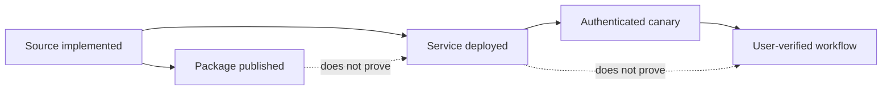

{/* Generated from data/public-capabilities.json. Run npm run docs:generate after changing the catalog. */}

Praxa reports package publication, deployed API reachability, authenticated qualification, and product availability as separate facts.

## Current developer surfaces

| Surface | Status | What the status proves | What it does not prove |
|---|---|---|---|
| [Execution Fabric](/fabric) | Partner preview | Submit, inspect, stream, and cancel durable tasks through the v1 API. | General availability or organization-tenant support. |
| [Integration Gateway missions](/concepts/missions) | Deployment-specific | Create governed missions with budgets, signals, resumable events, and cancellation. | A public shared Gateway origin or token issuer. |
| [TypeScript SDK](/sdk/overview) | Live | Use typed mission, event, capability, trace, skill, and memory contracts from Node.js. | That a separate runtime service is deployed or that your credential has authority. |
| [Praxa CLI](/cli/overview) | Live | Inspect versions, diagnose a Gateway, operate missions, and plan memory sources from a terminal or CI job. | That a separate runtime service is deployed or that your credential has authority. |
| [MCP contracts](/mcp/overview) | Live | Register 12 stable Aura-compatible wire tools in an MCP-compatible host. | That a separate runtime service is deployed or that your credential has authority. |
| [Memory federation](/memory-federation/overview) | Live | Query Mem0, LangGraph, Zep, Graphiti, Letta, OpenAI Agents, and custom sources without migrating first. | That a separate runtime service is deployed or that your credential has authority. |
| [Hosted memory candidates](/memory-federation/api) | Qualification preview | Stage portable, subject-scoped candidates for lexical query, export, and content-erasing deletion. | Authenticated positive, wrong-scope, revoked-key, or cross-tenant qualification. |
| [Signed webhooks](/fabric/api/webhooks) | Partner preview | Receive run lifecycle notifications, verify the raw body, and deduplicate retries. | General availability or organization-tenant support. |
| [Events, usage, and observability](/use-cases/monitoring-and-observability) | Partner preview | Reconnect to event streams, inspect terminal state, and reconcile usage without treating admission as completion. | General availability or organization-tenant support. |
| [API Playground](/api-playground/overview) | Live | Build and inspect Execution Fabric and hosted-memory requests directly from the documentation. | That a separate runtime service is deployed or that your credential has authority. |

## Publication policy

- A package is **live** only when the named version is publicly installable and its clean-install import succeeds.
- An API is **deployed** only when its production route and authentication boundary are observed.
- A workflow is **qualified** only after its required authenticated positive and negative cases run against the intended tenant boundary.
- A Praxa product capability is **live** only on the surfaces listed in the Capability Atlas.
- Building, dark, parked, and removed work never appears as a normal happy-path integration.

<Note>
Deployment revisions and engineering receipts belong in operational release records. User-facing guides show the public status, supported version, and actionable limitation instead of implementation details.
</Note>
